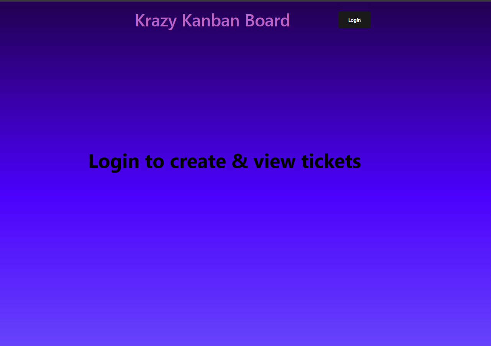
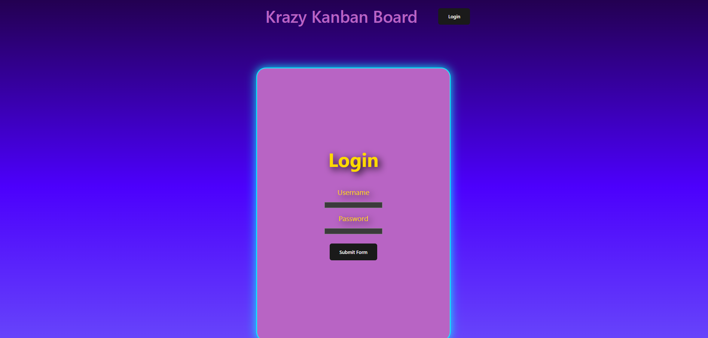
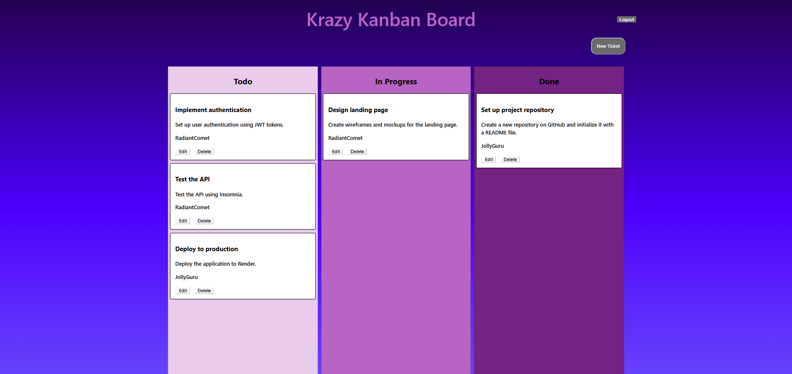
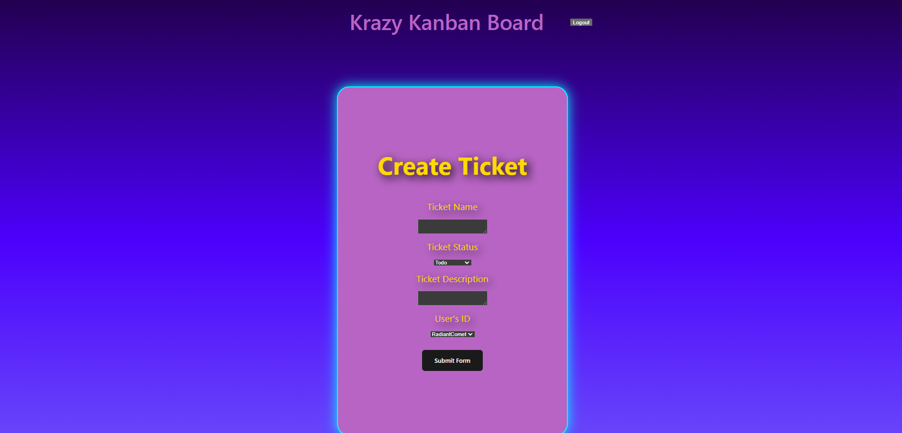
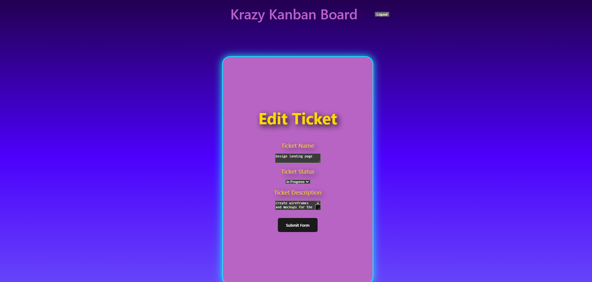

# First Kanban Board

## Description

To set up the authentication for a Kanban board using JSON Web tokens

## Table of Contents

- [Description](#description)
- [Installation](#installation)
- [Usage](#usage)
- [License](#license)
- [Contributions](#contributions)
- [Tests](#tests)
- [Questions](#questions)

## Installation

GitHubRepo: https://github.com/JHebenstreit48/first-kanban-board

Deployed Site: https://kanban-board-4jiv.onrender.com/


Home



Login



Main Kanban



Create Ticket



Edit Ticket



## Usage

To enable a user to login to a Kanban board and set tasks for a project.

## License
  This project is licensed under the [MIT](https://opensource.org/license/MIT) license.

## Contributions

I used the following activities 25 and 26 in the class repository for this project.

## Tests

The following commands were used to test this sites operation:

```bash
npm build
npm run seed
npm run start:dev
```
  
## Questions

For any further questions you can contact me at [j.hebenstreit.developer@gmail.com](mailto:j.hebenstreit.developer@gmail.com). You can find projects I have created or participated in at [https://github.com/JHebenstreit48](https://github.com/https://github.com/JHebenstreit48).

